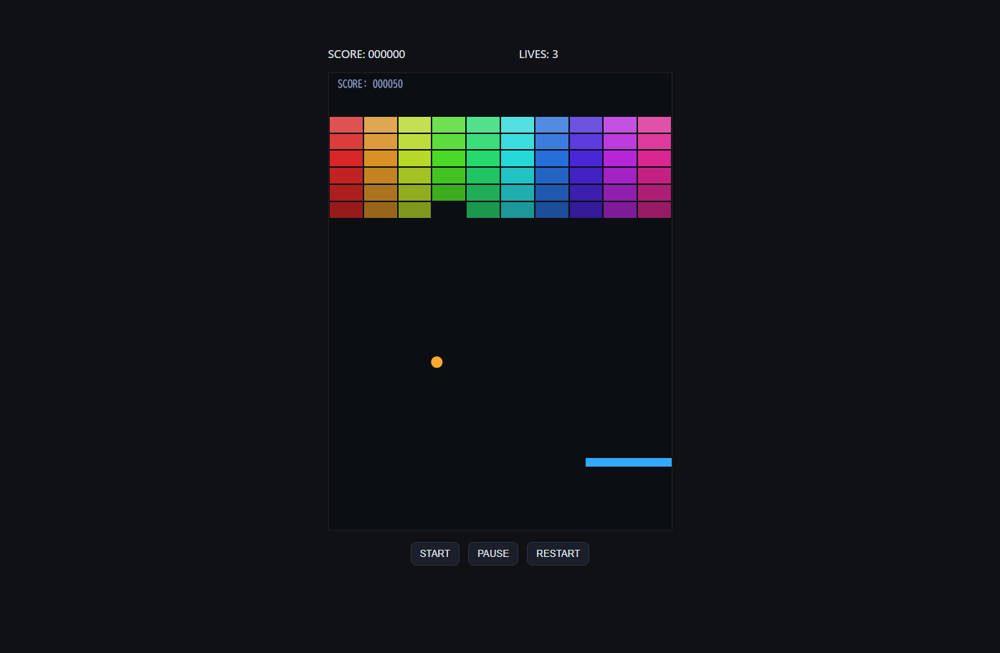

# 🧱 LG Block Breaker



**Vanilla JavaScript製ブロック崩し（自作物理エンジン）**

ゲームエンジン・物理処理・状態管理を**すべて純粋なJavaScriptで自作**したサンプル。  
ライブラリ非依存（Matter.js など不使用）。  
小規模でも責務分離された構造を重視し、設計力・保守性・拡張性を体現したプロジェクト。

---

## 🎮 デモ概要

| 項目 | 内容 |
|------|------|
| 言語 | JavaScript（ES Modules） |
| 構成 | HTML / CSS / JS（7ファイル構成） |
| 依存ライブラリ | なし（純粋なブラウザAPIのみ） |
| 実装範囲 | ゲームループ、物理反射、衝突判定、パドル操作、スコア管理、ブロック破壊 |
| 状態管理 | title / ready / playing / clear / gameover |

---

## 📂 ディレクトリ構成

```
block-breaker/
├── index.html       # CanvasとボタンUI
├── style.css        # スタイル（HUD / 背景）
├── game.js          # 司令塔：ループ・状態管理・全体制御
├── paddle.js        # プレイヤー操作処理
├── ball.js          # ボールの物理更新と反射処理
├── bricks.js        # ブロック群の生成・破壊管理
├── collision.js     # 衝突判定（円×矩形 / 縦横方向反射）
└── utils.js         # 共通関数（clamp, fitCanvas など）
```

---

## ⚙️ 設計思想

### 責務分離（Single Responsibility Principle）

| クラス / モジュール | 役割 | 比喩 |
|----------------------|------|------|
| `Game` | ゲーム全体の司令塔。状態管理・ループ制御。 | 指揮官 |
| `Paddle` | 入力を受けてプレイヤーのパドルを操作。 | 操縦士 |
| `Ball` | 物理演算・位置更新・壁反射。 | 弾丸 |
| `Bricks` | ステージ生成・描画・破壊。 | ステージ設計者 |
| `Collision` | 衝突判定と反射方向決定。 | 物理法則 |
| `utils` | 数学・座標系の共通関数。 | 言語・ツール |

---

## 🔁 ゲームループ設計

```js
update(dt)
 ├─ Paddle.update(dt)
 ├─ Ball.update(dt)
 ├─ Collision.ballWithPaddle()
 ├─ Collision.ballWithBricks()
 └─ 状態遷移・スコア更新

draw(ctx)
 ├─ 背景クリア
 ├─ Bricks.draw()
 ├─ Paddle.draw()
 ├─ Ball.draw()
 └─ HUD描画（スコア・状態表示）
```

---

## 🎯 技術的ポイント

- **物理演算の自作**  
  - `vx, vy` による速度ベクトル  
  - `Math.hypot`, `Math.atan2` を用いた方向制御  
  - 壁・ブロック・パドルの「めり込み量最小軸」で反射方向を決定  
- **FPS変動対策**：`dt` による時間スケーリング (`performance.now()` 基準)  
- **状態遷移管理**：タイトル／プレイ中／クリアのフラグ制御  
- **スコアHUD**：Canvas上に直接描画（DOM混在なし）  

---

## 🧠 学びと再利用ポイント

- **「物理エンジンを自作すると、すべてのシミュレーション問題が理解できる」**  
- **update/drawの分離**＝動的計画法の「状態と遷移」を実際に体感できる構造。  
- **clamp, min, max, abs** の使い方が自然に身につく。  
- **責務分離＋命名＋抽象化**＝オブジェクト指向の実戦的理解。  

---

## 🧩 今後の拡張構想

- 効果音（SE）追加  
- 残機・ライフ・ゲームオーバー演出  
- ステージ構成をJSONファイル化（データ駆動設計）  
- スピード曲線調整・パドル反射角補正  
- UIメニュー・タイトル画面・スコア保存

---

## 👨‍💻 作者メモ

> LazyGenius.dev / Leon.C  
> 「怠惰で仕組み化し、短気で高速化し、傲慢で品質を守る」  
> このプロジェクトは“動くコード”よりも“再利用できる設計”を目指した実験。  
> Matter.jsをあえて使わず、**自作のミニ物理エンジン**を通して基礎物理と状態遷移を理解するための教材として構築。

---
